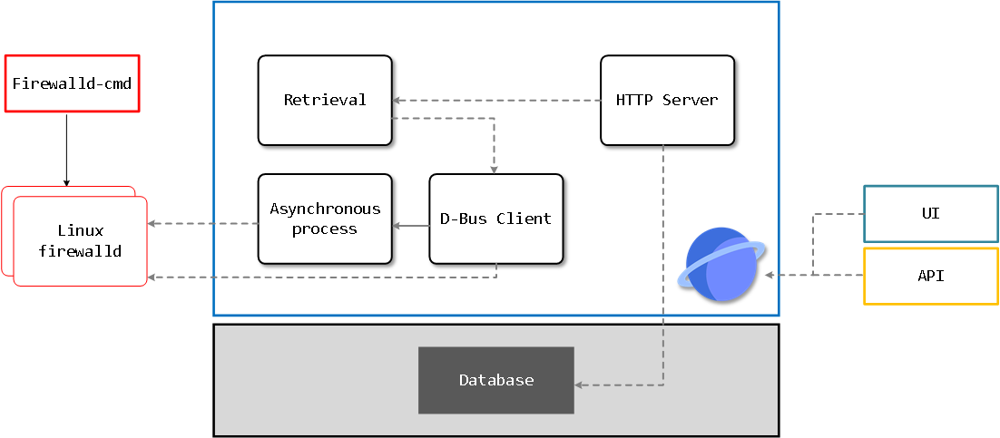
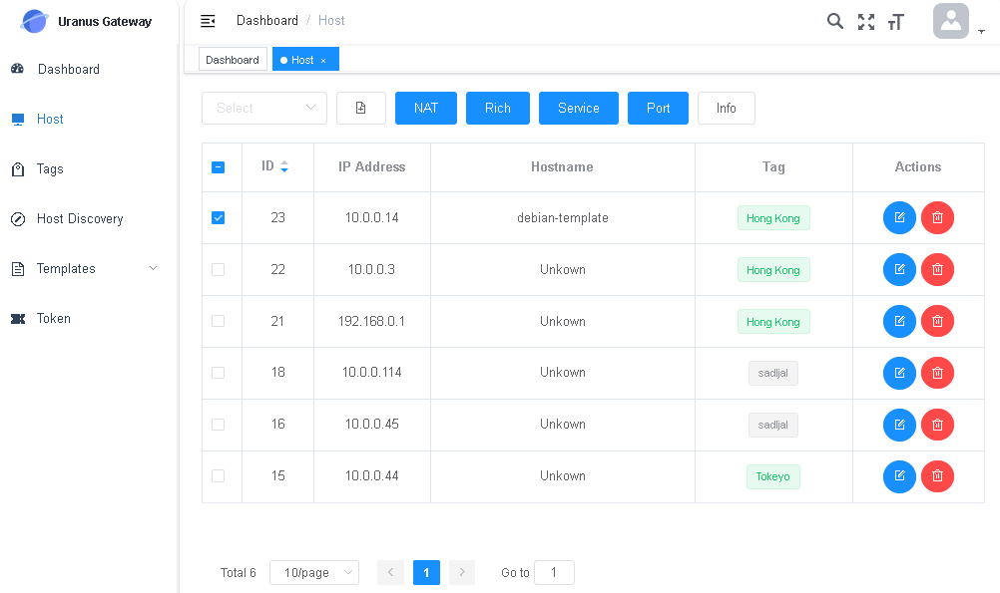
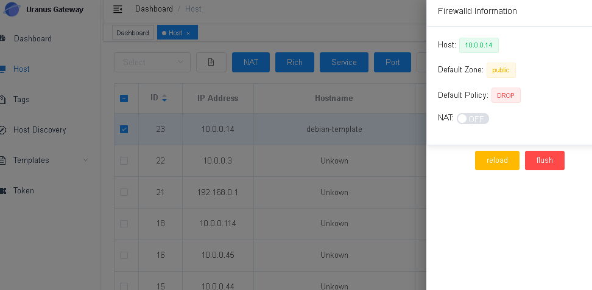
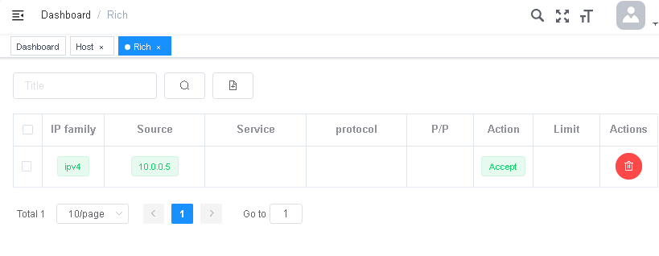
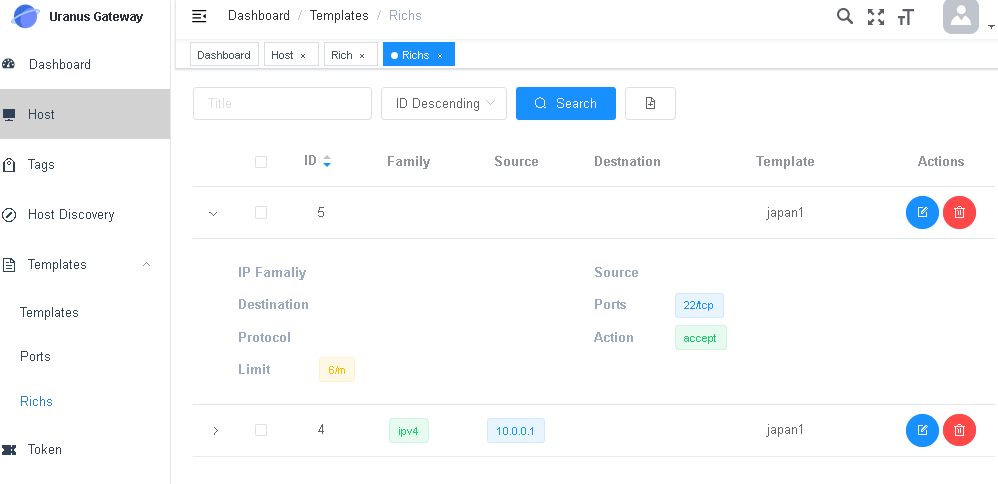
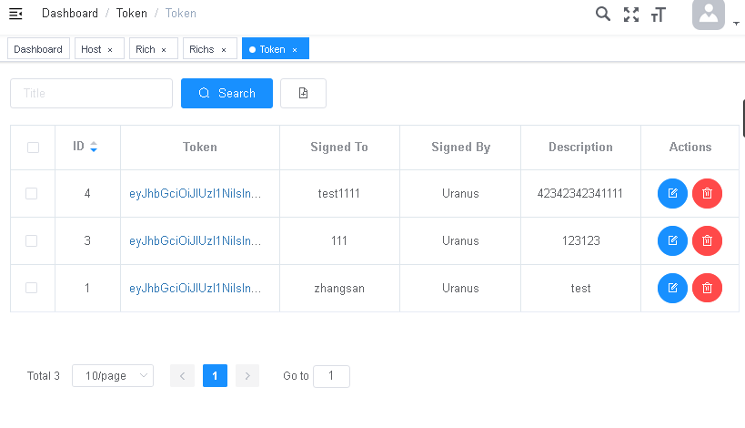
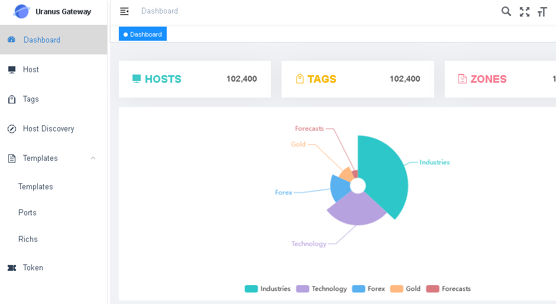

# Uranus

Uranus is a Linux firewalld central controller. In Greek mythology, Uranus king of gods. The firewall gateway is the Uranus for iptables.

## Quick start

https://www.oomkill.com/2024/08/uranus-installation/

## Show

### Show picture：:

▶ [Click](#Screenshot) ◀

### Show Video
- In China ▶ [bilibili](https://www.bilibili.com/video/BV1J24y1K7SD) ◀
- In World ▶ [YouTube](https://www.youtube.com/watch?v=v7HLZVA5V58) ◀



## Features
- Full firewalld features 
- Full D-BUS API convert to REST API.(currently converted OS debian11, centos7)
- Based dbus remotely.
- Declarative API and Imperative API.
- Asynchronous batch interface (only add).
- Can control thousands of linux machine via firewall gateway remotely.
- Support change tempate of thousands of machine fastly.
- Support wrong operation backoff.
- Support delay command effect.
- Support iptables NAT ipset timer task.
- Support template switch (only enable db).
- Only HTTP Service (without store).
- UI based VUE-element-admin.
- Support datacenter tag and machine management.
- Support SQLite & MySQL databases.

## TODO
- [X] Asynchronous batch process
- [X] optional API on (v3 only)
- [X] security policy
- [X] Delay task
- [X] UI
- [X] Authtication.
- [X] Deplyment on Kubernetes & Docker
- [ ] Prometheus Metics.
- [ ] WAF SDK.


## Deploy

To Compiling Uranus, execute following command:

```bash
git clone ..
make
```

To deploy Uranus on kubernetes, execute following command:

```
kubectl apply -f https://raw.githubusercontent.com/cylonchau/firewalld-gateway/main/deploy/deployment.yaml
```

To run Uranus on docker, execute following command:

```bash
docker run -d --rm  cylonchau/uranus
```

if you think update you dbus-daemon verion to lasest, can use `dbus.spec` make your package.

## use

Swagger API Doc: host:port/swagger/index.html

- v1 runtime resource.
- v2 permanent resource.
- v3 Asynchronous batck opreation.

## FAQ

### Why not use ssh or ansible tools.

Because D-Bus support remotely and firewalld implemented full D-Bus API, so we can batch manage iptables rules via firealld.

### How diffrence your project and other

firewall gateway implemented full dbus API convert to HTTP API, so can control thousands of machine via gateway. And ohter project update iptables via agent scripts. or only run on one machines.


### Is enable D-Bus remotely safe?

We can open D-Bus port only accpet gateway's IP, so is safed

default if you machine hacked, enable of disable D-Bus remote, it doesn't make any sense. Because hacker can run any command on your machine.

If you machine Is safe, so we can through open D-Bus port only accpet gateway's IP, so can management iptables rules via gateway and UI

For example

- The layer 1, you can add iptables rule restrict dbus tcp port.
- The layer 2, you can use dbus ACL restrict request.

To edit /etc/dbus-1/system.conf, example.

```xml
<policy context="default">
    <deny receive_path="/org/fedoraproject/FirewallD1" /> <!-- restrict all request -->
    <allow user="root" />
    <allow own="com.github.cylonchau.Uranus" /> <!-- allow uranus resiger to dbus-daemon -->
    <!-- if requseter is com.github.cylonchau.Uranus and request path is /org/fedoraproject/FirewallD1, then allow  -->
    <allow receive_sender="com.github.cylonchau.Uranus" receive_path="/org/fedoraproject/FirewallD1" />
</policy>
```

### How to output debug ?

```
-v 5 // full log
-v 4 // info log
-v 2 // no log
```

## Run

### migration

```bash
make build && \
    ./_output/firewalld-gateway  --migration --sql-driver=sqlite --config firewalld-gateway.toml -v 5
```
### Run

```bash
make build && \
    ./_output/firewalld-gateway --sql-driver=sqlite  --config firewalld-gateway.toml -v 5
```

## Screenshot











